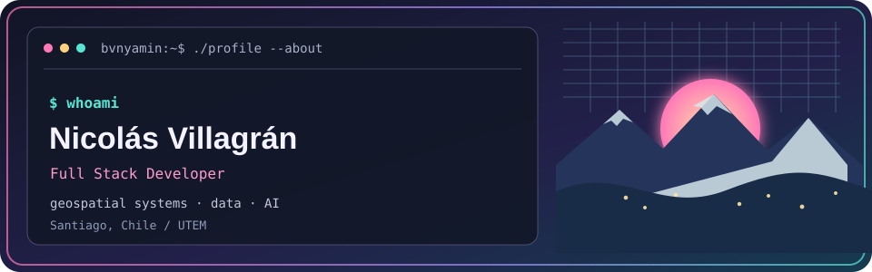
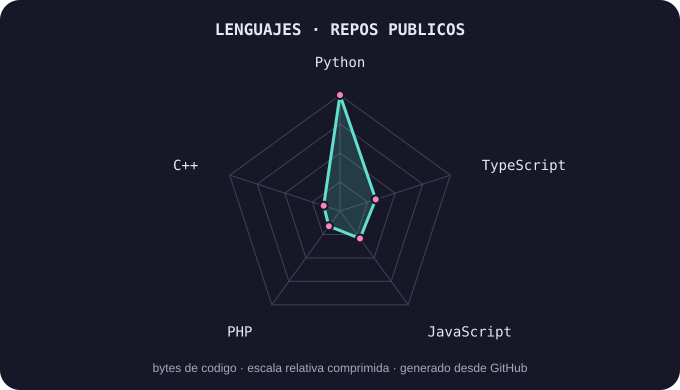

<a href="https://github.com/bvnyamin">
  <picture>
    <source media="(prefers-color-scheme: dark)" srcset="assets/banner-dark.svg">
    <source media="(prefers-color-scheme: light)" srcset="assets/banner-light.svg">
    
  </picture>
</a>

 

<picture>
  <source media="(prefers-reduced-motion: reduce)" srcset="assets/stack-static.svg">
  
</picture>

 

---

## `$ whoami`

Desarrollador Full Stack formado en **Ingeniería Informática en la UTEM**, con experiencia en aplicaciones web, bases de datos e infraestructura Linux. He trabajado con Python, Flask, JavaScript y tecnologías geoespaciales como QGIS Server.

En **Enel X** participé en el desarrollo y mejora de un sistema de gestión de incidencias georreferenciadas, desde el análisis de requerimientos hasta la implementación de funcionalidades y la presentación del producto a gerencia.

Mi proyecto de título fue un copiloto conversacional basado en **RAG y NL2SQL** para responder consultas en lenguaje natural sobre bases de datos de forma segura. Me interesa seguir creciendo en Backend, Full Stack, Cloud e inteligencia artificial aplicada a sistemas empresariales.

## `$ cat tech-stack.yaml`

<table>
  <tr>
    <td align="center" width="50%"><strong>Lenguajes</strong>  
      
    </td>
    <td align="center" width="50%"><strong>Frontend</strong>  
      
    </td>
  </tr>
  <tr>
    <td align="center"><strong>Backend y datos</strong>  
      
    </td>
    <td align="center"><strong>Herramientas y geoespacial</strong>  
       
      
      
      
    </td>
  </tr>
</table>

## `$ ls projects/`

<table>
  <tr>
    <td width="50%" valign="top">
      <h3><a href="https://github.com/bvnyamin/tesis-rag-f1">Tesis · RAG para Formula 1</a></h3>
      
Prototipo de preguntas en lenguaje natural que combina recuperación semántica y consultas SQL sobre datos estructurados.

      Python · Streamlit · PostgreSQL · Chroma · Docker
    </td>
    <td width="50%" valign="top">
      <h3><a href="https://github.com/bvnyamin/mi-portfolio">Mi portafolio</a></h3>
      
Sitio personal para presentar proyectos y experiencia.

      TypeScript · React
    </td>
  </tr>
  <tr>
    <td width="50%" valign="top">
      <h3><a href="https://github.com/bvnyamin/pilates-aledra">Web de gimnasio Pilates</a></h3>
      
Aplicación web con registro, inicio de sesión y recuperación de contraseña.

      HTML · CSS · JavaScript · PHP
    </td>
    <td width="50%" valign="top">
      <h3>Gestión georreferenciada de incidencias</h3>
      
Aplicación para administrar casos y visualizar información geográfica en mapas interactivos.

      Python · Flask · PostgreSQL/PostGIS · Leaflet
    </td>
  </tr>
</table>

## `$ git-language-signals`

  <picture>
    <source media="(prefers-color-scheme: dark)" srcset="assets/language-radar-dark.svg">
    <source media="(prefers-color-scheme: light)" srcset="assets/language-radar-light.svg">
    
  </picture>

Distribución relativa de código por lenguaje en repositorios públicos; no representa niveles de dominio. Se puede regenerar con <code>python scripts/generate_language_radar.py</code>.

